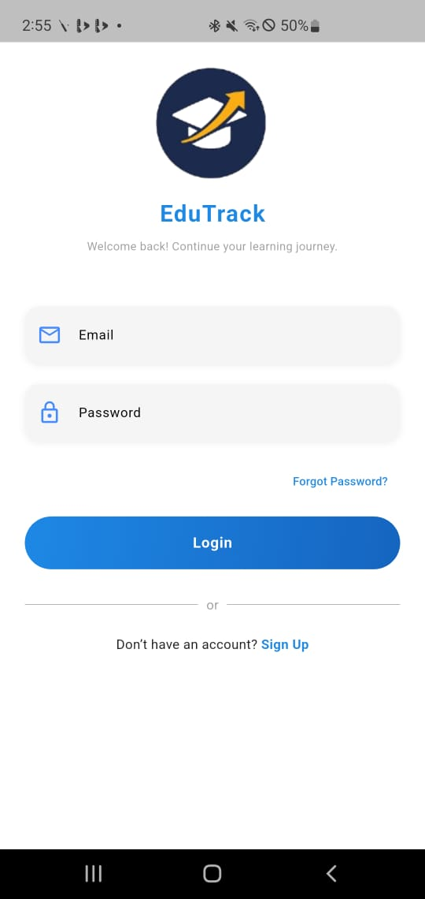
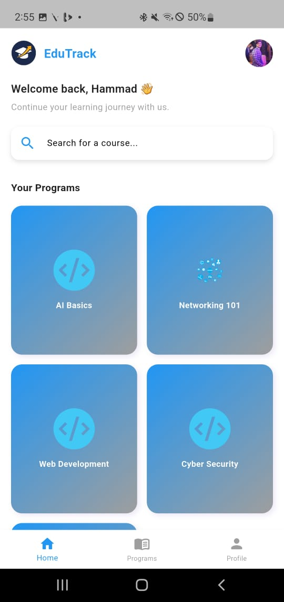
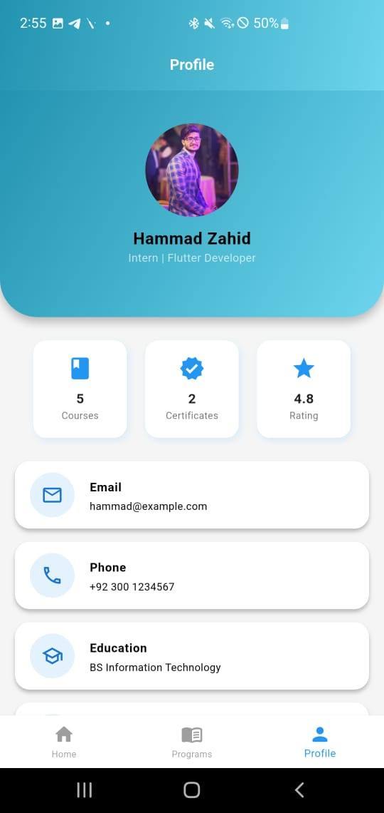
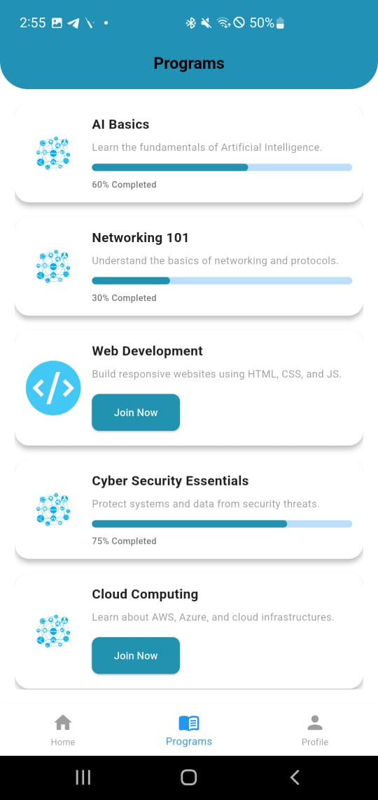

# 🌟 Flutter Internship Management App

A beautiful and modern Flutter application designed to manage internship programs, profiles, and progress tracking.

## 🚀 Features
- 🔐 User Login & Signup
- 👤 Interactive Profile Page
- 📚 Internship Programs List
- 📈 Progress Tracking
- 🎨 Gradient AppBars and Smooth UI

---

## 📱 Screenshots

| Login Screen | Programs Screen                                      |
|---------------|------------------------------------------------------|
|  |  |

| Profile Screen | Program details Screen                                         |
|----------------|----------------------------------------------------------------|
|  |  |

---

## 🛠 Tech Stack
- Flutter (Dart)
- Material Design
- Responsive UI

---

## 💻 Setup
```bash
git clone https://github.com/hammad89170/Edutrack.git
cd Edutrack
flutter pub get
flutter run
